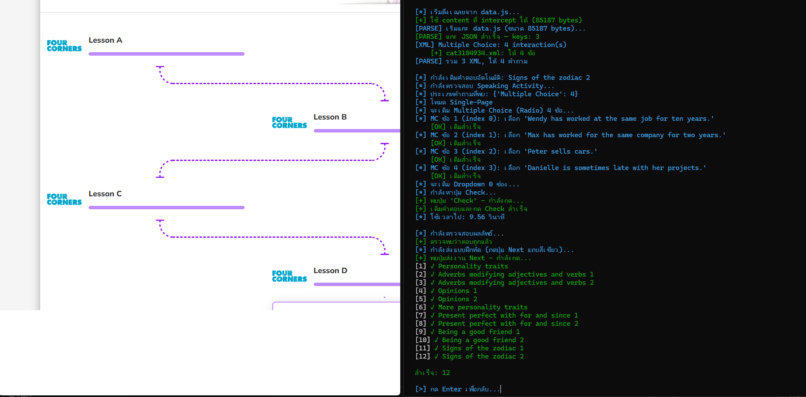

# Cambridge One Auto-Solver

> เครื่องมืออัตโนมัติสำหรับช่วยจัดการแบบฝึกหัดบน Cambridge One Digital Workbook
>
> พัฒนาด้วย Python, Playwright และ AsyncIO



## สถานะโปรเจกต์

โปรเจกต์อยู่ระหว่างการพัฒนา ฟีเจอร์หลักสำหรับการดึงเฉลยและเติมคำตอบอัตโนมัติพร้อมใช้งานแล้ว แต่แบบฝึกหัดบางประเภทอาจมีโครงสร้างหน้าเว็บแตกต่างกันและต้องทดสอบเพิ่มเติม

## เกี่ยวกับโปรแกรม

โปรแกรมจะเปิด Chrome ด้วยโปรไฟล์แยกตามบัญชี จากนั้นเข้าสู่ Cambridge One และให้เลือกคอร์ส บทเรียน และแบบฝึกหัดที่ต้องการทำงาน โดยสามารถทำงานได้ทั้งแบบเลือกทีละข้อและแบบอัตโนมัติหลายบท

## ฟีเจอร์หลัก

| ฟีเจอร์ | สถานะ |
|---|---|
| เข้าสู่ระบบ Cambridge One และใช้ session เดิม | ใช้งานได้ |
| จัดการหลายบัญชีและเลือกบัญชีจากเมนู | ใช้งานได้ |
| บันทึกบัญชีและรหัสผ่านไว้ใช้ครั้งถัดไป | ใช้งานได้ |
| เปิด Chrome profile แยกตามบัญชี | ใช้งานได้ |
| ดึงรายการคอร์ส, Units, Lessons และ Exercises | ใช้งานได้ |
| Refresh รายการคอร์สหรือบทเรียน | ใช้งานได้ |
| ดึงเฉลยจาก `data.js` และแปลงข้อมูล XML/QTI | ใช้งานได้ |
| รองรับ Multiple Choice แบบ Radio | ใช้งานได้ |
| รองรับ Multiple Choice แบบ Checkbox หลายคำตอบ | ใช้งานได้ |
| รองรับ Text Entry | ใช้งานได้ |
| รองรับ Dropdown | ใช้งานได้ |
| รองรับ Click-to-fill / Drag & Drop | ใช้งานได้ |
| รองรับ Multiple Choice แบบหลายหน้า | ใช้งานได้ |
| รองรับ Speaking Activity และ Interactive Speaking | ใช้งานได้บางส่วน |
| เติมคำตอบ, กด Check และส่งงานอัตโนมัติ | ใช้งานได้ |
| Retry เมื่อตอบผิดหรือทำแบบฝึกหัดไม่สำเร็จ | ใช้งานได้ |
| ใช้ฐานข้อมูลคำตอบที่บันทึกไว้เพื่อลดการดึงข้อมูลซ้ำ | ใช้งานได้ |
| แสดงคะแนนและเวลาที่ใช้ต่อแบบฝึกหัด | ใช้งานได้ |
| ทำแบบฝึกหัดที่ยังไม่เสร็จหรือทำทุกข้อ | ใช้งานได้ |
| ทำทุกงานในบทเดียวหรือทุกบทในคอร์ส | ใช้งานได้ |
| บันทึก log แยกตาม session | ใช้งานได้ |

## การติดตั้ง

### ความต้องการของระบบ

- Python 3.9 ขึ้นไป
- Google Chrome
- Windows, macOS หรือ Linux

### ขั้นตอนติดตั้ง

```bash
git clone https://github.com/Zentrary/CambridgeOne_Autobot.git
cd CambridgeOne_Autobot

python -m venv venv

# Windows
venv\Scripts\activate

# macOS / Linux
# source venv/bin/activate

pip install playwright requests colorama pyttsx3
playwright install chromium
```

## วิธีใช้งาน

```bash
python main.py
```

ลำดับการใช้งานหลัก:

1. เลือกบัญชีหรือเพิ่มบัญชีใหม่
2. เข้าสู่ระบบ หรือใช้ session เดิมจาก Chrome profile
3. เลือกคอร์สและ Unit
4. เลือกแบบฝึกหัดหรือโหมดทำงานอัตโนมัติ
5. เลือกว่าจะทำเฉพาะข้อที่ยังไม่เสร็จหรือทำทุกข้อ
6. ตรวจสอบผลลัพธ์และคะแนนจากหน้าจอโปรแกรม

เมนูที่มีให้ใช้งาน ได้แก่ แสดงเฉลย, เติมคำตอบและส่งงาน, เติมคำตอบพร้อม Retry, ทำ Speaking Activity, ดูฐานข้อมูลคำตอบ และ Refresh ข้อมูล

## โครงสร้างไฟล์

```text
CambridgeOne_Autobot/
├── main.py                    # โปรแกรมหลัก
├── README.md                 # เอกสารโปรเจกต์
├── image.png                 # ภาพประกอบ README
├── run.bat                   # สคริปต์รันบน Windows
├── answers_db.json           # ฐานข้อมูลคำตอบที่ดึงไว้
├── cambridge_accounts.json   # บัญชีที่บันทึกไว้
├── logs/                     # log แยกตาม session
└── chrome_data/              # Chrome profile แยกตามบัญชี
```

ไฟล์ `answers_db.json`, `cambridge_accounts.json`, `logs/` และ `chrome_data/` อาจถูกสร้างหรือเปลี่ยนแปลงระหว่างการใช้งาน

## ความปลอดภัยและความเป็นส่วนตัว

- โปรแกรมใช้ Chrome profile แยกตามบัญชีเพื่อเก็บ session
- หากเลือกบันทึกรหัสผ่าน โปรแกรมจะเก็บรหัสผ่านไว้ใน `cambridge_accounts.json` บนเครื่อง ดังนั้นควรป้องกันไฟล์นี้และไม่ commit ขึ้น repository สาธารณะ
- ข้อมูลคำตอบและ log ถูกเก็บไว้ในเครื่องภายในโปรเจกต์
- ใช้งานเฉพาะบัญชีและเนื้อหาที่คุณมีสิทธิ์เข้าถึง และปฏิบัติตามข้อกำหนดของ Cambridge One

## Known Issues

- Click-to-fill / Drag & Drop บางแบบฝึกหัดอาจเติมคำตอบไม่สำเร็จ เนื่องจากหน้าเว็บใช้ event การลากของ JavaScript เฉพาะทาง
- Multi-Page Multiple Choice และ Dropdown บางรูปแบบอาจต้องทดสอบเพิ่มเติมเมื่อโครงสร้างหน้าเว็บเปลี่ยนแปลง
- Speaking Activity อาจต้องใช้ปุ่ม Skip หรือ Speak ตามรูปแบบของกิจกรรม

## Roadmap

- ปรับปรุง Drag & Drop ให้รองรับแบบฝึกหัดที่ใช้ mouse event มากขึ้น
- เพิ่มความแม่นยำของการตรวจจับหน้าใน Multi-Page Activity
- รองรับแบบฝึกหัด Listening ให้ครอบคลุมมากขึ้น
- เพิ่ม GUI สำหรับการใช้งานแบบไม่ต้องใช้ command line
- เพิ่มการส่งออกผลลัพธ์เป็นรายงาน

## การมีส่วนร่วม

หากพบปัญหาหรือมีข้อเสนอแนะ สามารถเปิด Issue ได้ที่ [GitHub Issues](https://github.com/Zentrary/CambridgeOne_Autobot/issues)

## License

MIT License
